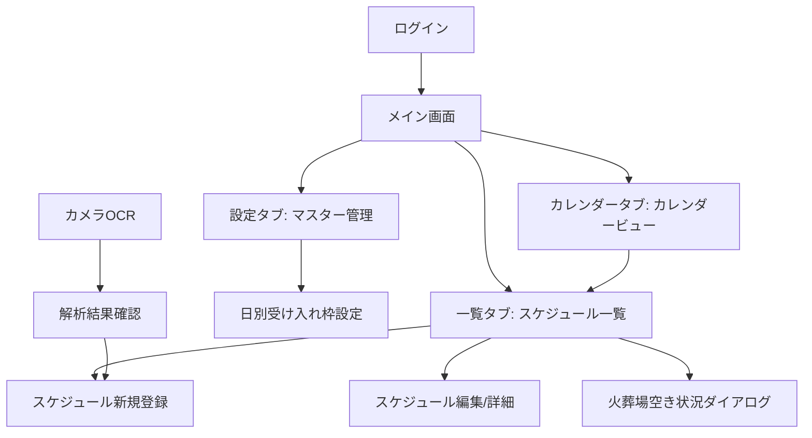

# 搬送アシスト 要件定義書

> **最終更新日**: 2026-02-25  
> **バージョン**: 1.0  
> **ステータス**: 運用中

---

## 1. プロジェクト概要

### 1.1 目的
葬儀搬送業務における斎場ホールの予約状況管理を効率化するWebアプリケーション。
手書き台帳やExcelによる管理から脱却し、リアルタイムな空き状況確認・予約登録・運用ルール自動判定を実現する。

### 1.2 対象ユーザー
- 葬儀搬送会社のオペレーター（日常的にスケジュールを管理する担当者）
- 管理者（斎場の制限ルールや受け入れ枠を設定する責任者）

### 1.3 利用環境
- **主要デバイス**: スマートフォン（モバイルファースト設計）
- **対応ブラウザ**: モダンブラウザ（Chrome, Safari, Edge）
- **ネットワーク**: インターネット接続必須

---

## 2. 技術スタック

| カテゴリ | 技術 |
|---------|------|
| フロントエンド | Next.js 16, React 19, TypeScript |
| UIライブラリ | shadcn/ui (Radix UI), Tailwind CSS 4 |
| バックエンド/DB | Supabase (PostgreSQL, Auth, Realtime) |
| AI/OCR | Google Gemini API (gemini-2.5-flash) |
| Webスクレイピング | Cheerio |
| フォーム管理 | React Hook Form + Zod |
| 日付処理 | date-fns |
| デプロイ | Vercel |

---

## 3. データベース設計

### 3.1 テーブル一覧

#### `facilities` — 斎場マスタ
| カラム | 型 | 説明 |
|--------|-----|------|
| id | UUID (PK) | 斎場ID |
| name | TEXT | 斎場名 |
| is_active | BOOLEAN | 有効フラグ |
| start_hour | INTEGER | 営業開始時間 (デフォルト: 9) |
| end_hour | INTEGER | 営業終了時間 |
| funeral_block_time | TEXT | 葬儀ブロック時刻（この時刻以降の葬儀は通夜予約不可） |
| turnover_interval_hours | INTEGER | 入替インターバル時間（デフォルト: 8時間） |
| wake_min_time | TEXT | 通夜受付開始の最小時刻（デフォルト: '18:00'） |
| turnover_rules | JSONB | 個別マッピングルール（高度な設定） |

#### `halls` — ホールマスタ
| カラム | 型 | 説明 |
|--------|-----|------|
| id | UUID (PK) | ホールID |
| name | TEXT | ホール名 |
| facility_id | UUID (FK) | 所属斎場 |

#### `schedules` — スケジュール
| カラム | 型 | 説明 |
|--------|-----|------|
| id | UUID (PK) | スケジュールID |
| date | DATE | 日付 |
| hall_id | UUID (FK) | ホールID |
| slot_type | TEXT | 種別（`葬儀` / `通夜`） |
| status | TEXT | ステータス（`available` / `occupied` / `preparing` / `external`） |
| ceremony_time | TEXT | 開式時刻（HH:MM） |
| family_name | TEXT | 喪家名 |
| remarks | TEXT | 備考 |

#### `daily_capacities` — 日別受け入れ枠
| カラム | 型 | 説明 |
|--------|-----|------|
| id | UUID (PK) | |
| date | DATE | 日付 |
| hall_id | UUID (FK) | ホールID |
| max_count | INTEGER | 一日の最大受け入れ件数 |

#### `rokuyo` — 六曜マスタ
| カラム | 型 | 説明 |
|--------|-----|------|
| date | DATE (PK) | 日付 |
| rokuyo | TEXT | 六曜名（大安, 友引, 先勝, etc.） |
| is_tomobiki | BOOLEAN | 友引フラグ |

#### `cremation_vacancies` — 火葬場空き状況
| カラム | 型 | 説明 |
|--------|-----|------|
| date | DATE | 日付 |
| time | TEXT | 時間枠 |
| available_count | INTEGER | 空き件数 |

---

## 4. 機能要件

### 4.1 認証機能

| ID | 要件 |
|----|------|
| AUTH-01 | メールアドレス・パスワードによるログイン（Supabase Auth） |
| AUTH-02 | セッション管理（自動リフレッシュ） |
| AUTH-03 | 未認証ユーザーはログインページへリダイレクト |
| AUTH-04 | ログアウト機能 |

---

### 4.2 スケジュール一覧（メイン画面）

ホール単位のスケジュールをカード形式で表示する、モバイル最適化画面。

| ID | 要件 |
|----|------|
| SCH-01 | 日付切り替え（前日/翌日ボタン、カレンダーポップアップ） |
| SCH-02 | 斎場の横スワイプ切り替え（**ループ対応**: 最後→最初、最初→最後） |
| SCH-03 | 斎場セレクトボックスによるダイレクト選択 |
| SCH-04 | ホールごとに葬儀/通夜の予約状況をカード表示 |
| SCH-05 | 空き枠への新規予約リンク（プリフィル対応） |
| SCH-06 | 既存予約の詳細/編集リンク |
| SCH-07 | 「他社予約」（external）の斜線スタイル表示 |
| SCH-08 | 受け入れ枠未設定時のインライン枠設定フォーム |
| SCH-09 | 友引（六曜）の告知バナー |
| SCH-10 | 通夜予約制限の自動判定表示（インターバル/ブロック/受付開始枠） |
| SCH-11 | ❌ 予約不可理由の明示（友引、ルール制限など） |
| SCH-12 | Realtime購読によるデータの自動更新 |
| SCH-13 | 日付・施設の状態をURL・localStorageに永続化 |
| SCH-14 | ページインジケーター（ドット表示） |

---

### 4.3 火葬場空き状況連携

蒲郡地域の斎場に関連する、外部火葬場（とぼね）の空き状況を管理。

| ID | 要件 |
|----|------|
| CRE-01 | 対象斎場表示時に「空き状況を確認」ボタンを表示 |
| CRE-02 | ダイアログで時間枠ごとの空き件数を表示 |
| CRE-03 | 外部予約システムのWebスクレイピングによるデータ同期（Cheerio） |
| CRE-04 | 手動「更新」ボタンによる再同期 |
| CRE-05 | 公式予約システムへの外部リンク |
| CRE-06 | 時刻ソート対応（9:30が10:00より前に表示） |

---

### 4.4 スケジュール登録/編集フォーム

| ID | 要件 |
|----|------|
| FORM-01 | 日付、開式時刻、ホール、種別（葬儀/通夜）、ステータス、喪家名、備考の入力 |
| FORM-02 | Zodバリデーション（必須チェック、形式チェック） |
| FORM-03 | URLクエリパラメータによるプリフィル（日付、ホール、種別など） |
| FORM-04 | 友引チェック（葬儀登録時に警告・ブロック） |
| FORM-05 | 入替ルール自動判定: 基本インターバル計算 |
| FORM-06 | 入替ルール自動判定: 通夜受付開始の最小時刻（`wake_min_time`） |
| FORM-07 | 入替ルール自動判定: 葬儀ブロック時刻によるブロック |
| FORM-08 | 入替ルール自動判定: 個別マッピングルールの優先適用 |
| FORM-09 | 制限理由のトースト通知（インターバル/受付開始枠/個別ルール） |
| FORM-10 | 時間選択UIのグレーアウト（制限範囲外の時間を非活性化） |
| FORM-11 | 「他社予約」モード（external: 喪家名不要、斜線スタイル） |
| FORM-12 | 予約の削除機能（確認ダイアログ付き） |
| FORM-13 | 編集完了後に元のリストページへ戻る（戻り先URL保持） |

---

### 4.5 カレンダービュー

全施設・全ホールのスケジュールをマトリクス形式で俯瞰する画面。

| ID | 要件 |
|----|------|
| CAL-01 | 週表示/月表示の切り替え |
| CAL-02 | 日付ヘッダーの固定表示（縦スクロール時にsticky） |
| CAL-03 | ホール名の固定表示（横スクロール時にsticky） |
| CAL-04 | 各セルにスケジュール件数・色分けバッジ表示 |
| CAL-05 | 友引の背景色表示・透かし表示 |
| CAL-06 | 六曜表示（日付ヘッダー内） |
| CAL-07 | 受け入れ枠の充足率表示（x/y形式） |
| CAL-08 | セルクリックで一覧ページへ遷移（日付・施設プリフィル） |
| CAL-09 | 枠未設定ホバー表示 |
| CAL-10 | Realtime購読によるデータの自動更新 |
| CAL-11 | 表全体の内部スクロール（max-height制限） |

---

### 4.6 マスター管理画面（設定）

斎場ごとの制限ルールを設定する管理画面。

| ID | 要件 |
|----|------|
| ADM-01 | 斎場ごとの設定カード表示 |
| ADM-02 | 入替インターバル時間の設定（時間単位） |
| ADM-03 | 通夜受付開始の最小時刻（`wake_min_time`）の設定 |
| ADM-04 | 葬儀ブロック時刻の設定 |
| ADM-05 | 個別マッピングルールの追加/削除（高度な設定セクション） |
| ADM-06 | 判定プロセスのシミュレーション（各葬儀開式時刻に対する結果プレビュー） |
| ADM-07 | シミュレーションはブロック時間以降の時間帯カードを非表示 |
| ADM-08 | ルール適用順序の説明表示（個別ルール → ブロック → インターバル + 受付開始枠） |
| ADM-09 | 設定の保存（Supabase upsert） |

---

### 4.7 日別受け入れ枠設定

ホールごとの一日の受け入れ可能件数を設定する画面。

| ID | 要件 |
|----|------|
| CAP-01 | ホール選択（施設別グループ表示） |
| CAP-02 | 週単位での枠一括表示・編集 |
| CAP-03 | 上限数の選択（0〜3本、未設定） |
| CAP-04 | 既存予約との整合性チェック（予約件数を下回る枠には変更不可） |
| CAP-05 | 一括保存 |

---

### 4.8 カメラOCR登録

手書きの受付状況表を撮影してスケジュールを自動登録する機能。

| ID | 要件 |
|----|------|
| OCR-01 | カメラ撮影または画像アップロード |
| OCR-02 | Gemini API（gemini-2.5-flash）による画像解析 |
| OCR-03 | マトリクス形式の表（横軸:日付、縦軸:施設/ホール）の読み取り |
| OCR-04 | 抽出結果の確認・修正フォーム |
| OCR-05 | 確認後にSupabaseへ一括登録 |
| OCR-06 | ステータス自動判定（×/手書き名→occupied、仮→preparing、空白→available） |

---

## 5. ビジネスルール

### 5.1 入替制限ルール

施設の制限ルールは以下の優先順位で判定される：

```
1. 個別マッピングルール（最優先）
   - 特定の葬儀開式時刻に対して、通夜の最小時刻や予約不可を定義
   
2. 葬儀ブロック時刻
   - 指定時刻以降の葬儀については、同日の通夜予約を一律不可

3. 基本設定（インターバル + 通夜受付開始の最小時刻）
   - 葬儀開式時刻 + インターバル時間 = 最小通夜開始時刻
   - ただし wake_min_time（例: 18:00）を下回る場合は引き上げ
   - 例: 葬儀 09:30 + 8h = 17:30 → wake_min_time 18:00 に引き上げ
```

### 5.2 友引ルール
- 友引の日は葬儀の登録を制限（告知バナー表示）
- 火葬場の空きも0件として扱う

### 5.3 受け入れ枠ルール
- 枠未設定のホールはスケジュール登録不可
- 枠が上限に達したホールは満室表示

---

## 6. 非機能要件

| カテゴリ | 要件 |
|---------|------|
| リアルタイム性 | Supabase Realtimeによる即座のデータ反映 |
| レスポンシブ | モバイルファースト設計、デスクトップ対応 |
| パフォーマンス | SSR + Client-side Hydration、ローディングインジケーター |
| アクセシビリティ | セマンティックHTML、キーボードナビゲーション対応 |
| セキュリティ | Supabase Row Level Security、認証必須 |
| 状態永続化 | URL パラメータ + localStorage による操作コンテキスト保持 |

---

## 7. 画面構成



### ナビゲーション
- **モバイル**: 画面下部の固定タブバー（一覧 / カレンダー / 設定）
- **デスクトップ**: ヘッダー内のナビゲーションリンク

---

## 8. 外部連携

| 連携先 | 方式 | 用途 |
|--------|------|------|
| Supabase | REST API / Realtime WS | DB・認証・リアルタイム更新 |
| Google Gemini API | REST API (Server Action) | 画像OCR解析 |
| とぼね予約システム | Webスクレイピング (Server Action) | 火葬場空き状況の取得 |
