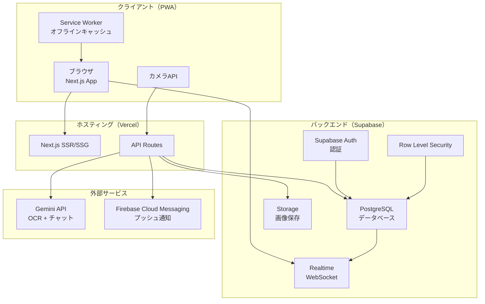
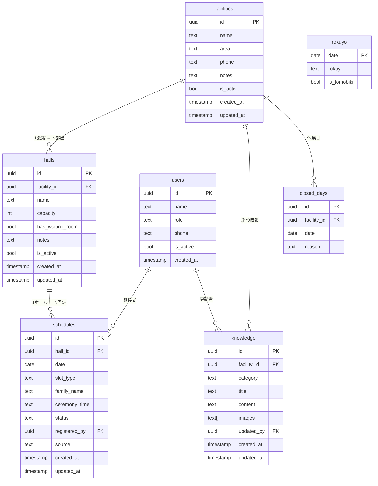
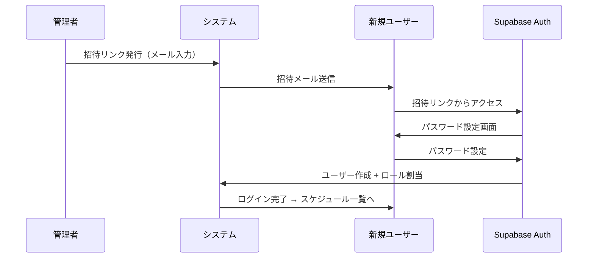
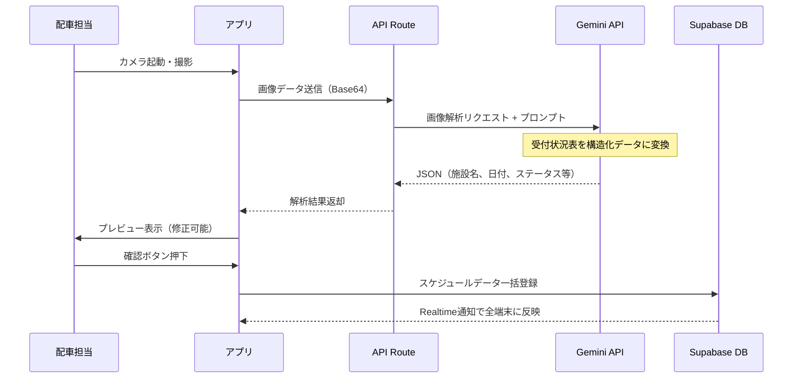

# 技術設計書：搬送アシスト

---

## 1. システムアーキテクチャ



## 2. 技術スタック詳細

| レイヤー | 技術 | バージョン（目安） | 用途 |
|---------|------|------------|------|
| フレームワーク | Next.js | 14+ (App Router) | SSR/SSG、APIルート、PWA |
| 言語 | TypeScript | 5.x | 型安全な開発 |
| スタイリング | Tailwind CSS | 3.x | ユーティリティファーストCSS |
| UIコンポーネント | shadcn/ui | latest | アクセシブルなUIパーツ |
| 状態管理 | Zustand | 4.x | 軽量ストア（オフラインキャッシュ用） |
| DB/認証 | Supabase | latest | PostgreSQL + Auth + Realtime |
| AI/OCR | Gemini API | 2.0 Flash | 画像解析 + チャット |
| プッシュ通知 | FCM | latest | バックグラウンド通知 |
| ホスティング | Vercel | - | 自動デプロイ + Edge Functions |
| テスト | Playwright | latest | E2Eテスト |

## 3. ディレクトリ構成

```
hansou-assist/
├── src/
│   ├── app/                    # Next.js App Router
│   │   ├── (auth)/             # 認証が必要なページ群
│   │   │   ├── schedule/       # ★メイン：スケジュール一覧
│   │   │   ├── calendar/       # カレンダービュー
│   │   │   ├── camera/         # OCR撮影画面
│   │   │   ├── chat/           # AIチャット
│   │   │   ├── knowledge/      # ナレッジ
│   │   │   └── admin/          # 管理者画面
│   │   ├── login/              # ログイン画面
│   │   ├── api/                # APIルート
│   │   │   ├── ocr/            # OCR解析エンドポイント
│   │   │   ├── chat/           # AIチャットエンドポイント
│   │   │   └── notify/         # プッシュ通知
│   │   ├── layout.tsx
│   │   └── page.tsx
│   ├── components/             # 共通コンポーネント
│   │   ├── ui/                 # shadcn/ui
│   │   ├── schedule/           # スケジュール関連
│   │   ├── camera/             # カメラ関連
│   │   └── chat/               # チャット関連
│   ├── lib/                    # ユーティリティ
│   │   ├── supabase/           # Supabaseクライアント
│   │   ├── gemini/             # Gemini APIクライアント
│   │   └── rokuyo/             # 六曜計算ロジック
│   ├── hooks/                  # カスタムフック
│   ├── stores/                 # Zustandストア
│   └── types/                  # TypeScript型定義
├── public/
│   ├── manifest.json           # PWAマニフェスト
│   └── sw.js                   # Service Worker
├── supabase/
│   ├── migrations/             # DBマイグレーション
│   └── seed.sql                # 初期データ（六曜等）
├── tests/                      # E2Eテスト
├── docs/                       # ドキュメント
├── next.config.js
├── tailwind.config.ts
├── tsconfig.json
├── middleware.ts               # 認証ミドルウェア
└── package.json
```

## 4. データベース設計（ER図）



## 5. 認証フロー



## 6. OCR処理フロー



### OCRプロンプト設計（案）

```
あなたは葬儀業界の受付状況表を読み取るOCRアシスタントです。
以下の画像から情報を抽出し、JSON形式で返してください。

出力フォーマット:
{
  "facility_name": "会館名",
  "date": "YYYY-MM-DD",
  "halls": [
    {
      "hall_name": "ホール名",
      "status": "available | occupied | preparing",
      "family_name": "喪家名（読み取れない場合はnull）",
      "ceremony_time": "HH:MM（読み取れない場合はnull）",
      "slot_type": "葬儀 | 通夜"
    }
  ]
}

注意事項:
- 「×」は occupied、「○」は available、「△」は preparing
- 手書き文字の場合、確信度が低い項目はnullを返す
- 日本語の旧字体にも対応すること
```

## 7. リアルタイム同期

### Supabase Realtimeの利用

```typescript
// スケジュール更新のリアルタイム購読
const channel = supabase
  .channel('schedules')
  .on(
    'postgres_changes',
    {
      event: '*',
      schema: 'public',
      table: 'schedules'
    },
    (payload) => {
      // ローカルストアを更新
      updateScheduleStore(payload);
    }
  )
  .subscribe();
```

### オフライン対応

1. **Service Worker** でスケジュールデータをローカルにキャッシュ
2. オフライン時はキャッシュを表示し、「最終同期: XX:XX」を明示
3. ネットワーク復帰時に自動で差分同期

## 8. セキュリティ設計

### Row Level Security (RLS)

```sql
-- スケジュール閲覧: 全認証ユーザーが可能
CREATE POLICY "schedules_select" ON schedules
  FOR SELECT USING (auth.role() = 'authenticated');

-- スケジュール編集: admin と dispatcher のみ
CREATE POLICY "schedules_insert" ON schedules
  FOR INSERT WITH CHECK (
    EXISTS (
      SELECT 1 FROM users
      WHERE users.id = auth.uid()
      AND users.role IN ('admin', 'dispatcher')
    )
  );

-- 施設マスター編集: admin のみ
CREATE POLICY "facilities_update" ON facilities
  FOR UPDATE USING (
    EXISTS (
      SELECT 1 FROM users
      WHERE users.id = auth.uid()
      AND users.role = 'admin'
    )
  );
```

## 9. パフォーマンス目標

| 指標 | 目標 | 手段 |
|------|------|------|
| 初回表示 (LCP) | 1.5秒以内 | SSG + Edge Caching |
| スケジュール一覧表示 | 500ms以内 | インデックス最適化 + ページネーション |
| OCR解析 | 3秒以内 | Gemini Flash + 画像圧縮 |
| リアルタイム反映 | 1秒以内 | Supabase Realtime WebSocket |
| オフライン→復帰同期 | 5秒以内 | Service Worker + 差分同期 |
